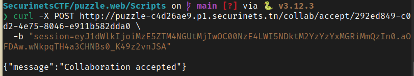
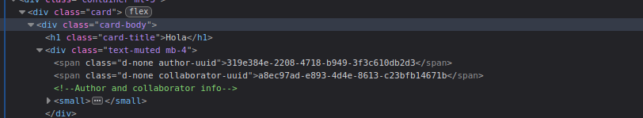
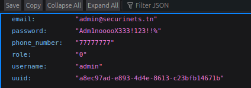

# Securinets CTF

## Puzzle - Web


El reto comienza dandonos una copia del código con un Dockerfile para replicar el entorno. Dentro del código, hay muchas rutas divididas en dos bloques principales: *auth.py*, donde se encuentran las rutas relacionadas a registro, y *routes.py*, donde están el resto de las rutas. Analizando el código, vemos que hay distintos roles: usuario, editor y admin. Es lógico suponer que nuestro objetivo es loguearnos como admin. Al registrar un usuario, vemos en la ruta *confirm-register* que podemos manipular el formulario para crearnos un usuario **editor**, pero no un admin. Creamos un script para esto (Script.py) y lo ejecutamos.  
Estar logueados como editor nos permite el acceso a distintas rutas que ser usuario no nos permite. Principalmente, vemos que podemos acceder a la ruta */users/<uuid>*. En esa ruta podremos acceder a la información de cualquier usuario, ya que no hay ningún tipo de control de accceso y, sobre todo, las contraseñas están guardadas en texto plano. Por tanto, nuestro objetivo es conseguir el uuid del admin.  
Analizando el resto de las rutas de **routes.py** vemos que podemos crear artículos con colaboradores, y esto crea una entrada en la tabla *collab_requests* con los **uuid** de los participantes. Esto podemos hacerlo directamente desde la página con el nombre de nuestro colaborador, que será **admin**. Nuestro objetivo ahora será acceder a esta collab_request. Vemos que hay dos rutas que acceden a esta tabla y que potencialmente podrían servirnos: *collab/request* y *collab/requests*. Sin embargo, ambas tienen una protección para que solo pueden ser accedidas desde el propio contenedor Docker do  nde están almacenadas, y es una protección que no podemos vulnerar.  
Nos enfocamos entonces en la ruta */collab/accept/<string:request_uuid>*. Analizandola, vemos que la ruta permite aceptar una colaboración, lo que publicaría el artículo. La ruta no tiene ningún tipo de control de acceso: no chequea quién es la persona que está accediendo ni que esta persona sea la misma a la que se le solicitó la colaboración, simplemente, chequea que sea un usuario existente y que no sea admin. Para entrar a esta ruta es necesario tener el **uuid** de la request. Este es un dato que aparece "oculto" en el listado de colaboraciones.  
  
Una vez con este dato, enviamos la request con curl
```
❯ curl -X POST http://<ruta>/collab/accept/<request-uuid> \
  -b "session=cookie-del-usuario-editor"
```
  
Esto nos acepta la colaboración y publica el artículo. Podemos ver los artículos en el navegador, e inspeccionando el código podremos ver el **uuid** de los colaboradores.    
Con esta información, finalmente podemos acceder a la información del administrador.  
  

Logueado como administrador, puedo entrar al panel de admin, que me da acceso a una ruta muy sospechosa llamada *ban_users*. Después de dar muchas vueltas, veo que finalmente esa ruta no me es útil. Estando como administrador tambien tengo acceso a la ruta */data* donde encuentro dos archivos: **secrets.zip** y **db_connect.exe**. El zip tiene una contraseña que lo protege, intento forzarla con **john** y con **fcrackzip** sin exito. Me vuelco al otro archivo y lo analizo con **strings**, allí encuentro las credenciales de la base de datos, entre ellas la contraseña. Pruebo esta contraseña en el .zip y finalmente encuentro la flag.  
  


